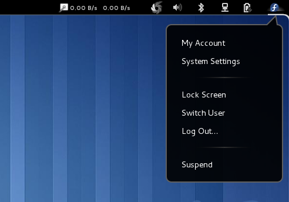

What is NoUserStatus?
===================

NoUserStatus is a gnome-shell extension that removes user name and IM status
from user menu.

What it looks like?
===================

Everybody loves screenshots, right?

Disclaimer
==========

As I couldn't find any real documentation for writing gnome-shell extensions, I based my code on better or worse snippets and tutorials found on internet. Some of the sources are mentioned below:

* `Musings of an OS plumber <http://blog.fpmurphy.com/tag/gnome-shell>`_
* `gnome-shell-extensions <http://git.gnome.org/browse/gnome-shell-extensions/>`_

Instalation
===========

  
The NoUserStatus@zdyb.tk directory should be copied to /usr/share/gnome-shell/extensions or ~/.local/share/gnome-shell/extensions/::

  # cp NoUserStatus\@zdyb.tk /usr/share/gnome-shell/extensions
  
or::

  $ cp NoUserStatus\@zdyb.tk ~/.local/share/gnome-shell/extensions/

License
=======

Copyright 2011 Aleksander Zdyb

This program is free software: you can redistribute it and/or modify it under the terms of the GNU General Public License as published by the Free Software Foundation, either version 3 of the License, or (at your option) any later version.

This program is distributed in the hope that it will be useful, but WITHOUT ANY WARRANTY; without even the implied warranty of MERCHANTABILITY or FITNESS FOR A PARTICULAR PURPOSE. See the GNU General Public License for more details.

You should have received a copy of the GNU General Public License along with this program.  If not, see http://www.gnu.org/licenses/.

Original author is Finnbarr P. Murphy.